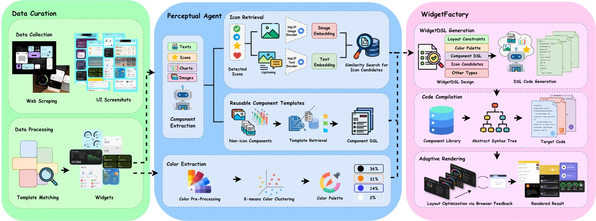

<div align="center">


# 🎨 Widget2Code: From Visual Widgets to UI Code via Multimodal LLMs

</div>


<div align="center">
<!--  -->
</div>


Widget2Code is a baseline framework that strengthens both perceptual understanding and system-level generation for transforming visual widgets into UI code. It leverages advanced vision-language models to automatically generate production-ready WidgetDSL from screenshots, featuring icon detection across 57,000+ icons, chart recognition for 8 chart types, and sophisticated layout analysis. This repository provides the implementation and tools needed to generate high-fidelity UI code.


<div align="center">
  <a href="https://arxiv.org/abs/PLACEHOLDER" target="_blank"></a>
  <a href=https://djanghao.github.io/widget2code/ target="_blank"></a>
  <a href=https://github.com/Djanghao/widget2code target="_blank"></a>
  <a href="https://www.apache.org/licenses/LICENSE-2.0" target="_blank"></a>

</div>


<p align="center">
    💻 <a href="./apps/playground">Interactive Playground</a> |
📊 <a href="#-benchmarks--evaluation">Benchmarks</a>&nbsp&nbsp
</p>

## 🔥🔥🔥 News
* 🚀 Dec 16, 2025: We release the complete Widget2Code framework including inference code, interactive playground, batch processing scripts, and evaluation tools.


## 🎥 Demo
<div align="center">
  <video src="https://github.com/user-attachments/assets/883112b1-6d78-4576-a356-2a7061f31751" width="60%" controls></video>
</div>

## 📋 Table of Contents
- [🎨 Widget2Code: From Visual Widgets to UI Code via Multimodal LLMs](#-widget2code-from-visual-widgets-to-ui-code-via-multimodal-llms)
  - [🔥🔥🔥 News](#-news)
  - [🎥 Demo](#-demo)
  - [📋 Table of Contents](#-table-of-contents)
  - [📖 Overview](#-overview)
  - [✨ Key Features](#-key-features)
    - [1. Widget Generation](#1-widget-generation)
    - [2. Component Library](#2-component-library)
    - [3. Interactive Playground](#3-interactive-playground)
  - [📜 System Requirements](#-system-requirements)
    - [Hardware Requirements](#hardware-requirements)
    - [Software Requirements](#software-requirements)
  - [🛠️ Dependencies and Installation](#️-dependencies-and-installation)
    - [Quick Install](#quick-install)
  - [⚙️ Configuration](#️-configuration)
  - [🚀 Quick Start](#-quick-start)
    - [Step 1: Start API Service](#step-1-start-api-service)
    - [Step 2: Generate Widgets (Batch)](#step-2-generate-widgets-batch)
    - [Step 3: Render Widgets (Batch)](#step-3-render-widgets-batch)
    - [Step 4: Evaluate Results](#step-4-evaluate-results)
    - [Interactive Playground (Optional)](#interactive-playground-optional)
  - [📊 Benchmarks \& Evaluation](#-benchmarks--evaluation)
    - [Performance Comparison](#performance-comparison)
    - [Evaluation Datasets](#evaluation-datasets)
    - [Download Benchmarks](#download-benchmarks)
  - [🏗️ Architecture](#️-architecture)
    - [Generation Pipeline](#generation-pipeline)
  - [📚 Citation](#-citation)


## 📖 Overview

**Widget2Code** is a baseline framework that strengthens both perceptual understanding and system-level generation for transforming visual widgets into UI code.

## ✨ Key Features

### 1. Widget Generation
Automatically generate WidgetDSL from screenshots using advanced vision-language models with:
- **Icon Detection and Retrieval**: FAISS-based similarity search across 57,000+ icons from multiple libraries (Lucide, SF Symbols, Heroicons, Feather, Material Design, and more)
- **Chart Recognition**: Specialized detection for 8 chart types (LineChart, BarChart, StackedBarChart, RadarChart, PieChart, ProgressBar, ProgressRing, Sparkline)
- **Layout Analysis**: Multi-stage layout detection with intelligent retry mechanism for robust component positioning
- **Color Extraction**: Sophisticated palette and gradient extraction with color preservation
- **Multi-Domain Support**: Optimized prompts for 15+ application domains (weather, utilities, communication, health & fitness, productivity, etc.)

### 2. Component Library
19 production-ready UI components with full icon support:
- **Layout**: WidgetShell (container with padding and background support)
- **Text**: Text, Button, AppLogo
- **Visual**: Icon, Image, MapImage, Divider, Indicator
- **Input**: Checkbox, Slider, Switch
- **Charts**: LineChart, BarChart, StackedBarChart, RadarChart, PieChart, ProgressBar, ProgressRing, Sparkline

### 3. Interactive Playground
Web-based interface for widget creation and experimentation:
- Real-time DSL editing and preview
- Component library browser
- Export to React JSX or HTML
- 50+ built-in examples

## 📜 System Requirements

### Hardware Requirements
- **GPU**: NVIDIA GPU with CUDA support (recommended for icon retrieval acceleration)
- **Memory**: Minimum 8GB RAM, 16GB+ recommended for batch processing
- **Storage**: ~2GB for model embeddings and icon database

### Software Requirements
- **Operating System**: Linux, macOS, or Windows (WSL2)
- **Node.js**: 18.x or higher
- **Python**: 3.10 or higher
- **CUDA**: Compatible CUDA version for PyTorch (if using GPU acceleration)

## 🛠️ Dependencies and Installation

### Quick Install

**One-Command Setup**:
```bash
./scripts/setup/install.sh
```

Installs all dependencies including Node.js packages and isolated Python environment.

## ⚙️ Configuration

Create `.env` file with API credentials:

```bash
cp .env.example .env
# Edit .env and add your API configuration
```

## 🚀 Quick Start

### Step 1: Start API Service

```bash
# Start API backend (required for batch processing)
npm run api
```

### Step 2: Generate Widgets (Batch)

```bash
# Batch generation with 5 concurrent workers
./scripts/generation/generate-batch.sh ./mockups ./output 5

# Force regenerate all images
./scripts/generation/generate-batch.sh ./mockups ./output 5 --force
```

### Step 3: Render Widgets (Batch)

```bash
# Batch rendering with 5 concurrent workers
./scripts/rendering/render-batch.sh ./output 5

# Force rerender all widgets
./scripts/rendering/render-batch.sh ./output 5 --force
```

### Step 4: Evaluate Results

```bash
# Evaluate generated widgets against ground truth
./scripts/evaluation/run_evaluation.sh ./output -g ./ground_truth

# Use GPU and more workers for faster evaluation
./scripts/evaluation/run_evaluation.sh ./output -g ./ground_truth --cuda -w 16
```

### Interactive Playground (Optional)

```bash
# Start interactive playground
npm run playground
```

## 📊 Benchmarks & Evaluation

### Performance Comparison

Widget2Code achieves state-of-the-art performance across multiple quality dimensions including layout accuracy, legibility, style preservation, perceptual similarity, and geometric precision.

<div align="center">
  
</div>

### Evaluation Datasets

Widget2Code has been evaluated on 13 benchmark datasets:
1. Seed1.6-Thinking
2. Gemini2.5-Pro
3. GPT-4o
4. Qwen3-VL
5. Qwen3-VL-235b
6. Design2Code
7. DCGen
8. LatCoder
9. UICopilot
10. WebSight-VLM-8B
11. Screencoder
12. UI-UG
13. Widget2Code

### Download Benchmarks

The evaluation results on multiple benchmarks are available for download:

**Download Link**: [Benchmarks Dataset (1.5GB)](https://drive.google.com/file/d/1TFLrW5lBLFX_hK7U9nQLRLiYn_hDOiT_/view?usp=sharing)

This archive contains evaluation results across all 13 benchmark datasets.

To use the benchmarks:
```bash
# Install gdown (if not already installed)
pip install gdown

# Download using gdown (1.5GB)
gdown --fuzzy "https://drive.google.com/file/d/1TFLrW5lBLFX_hK7U9nQLRLiYn_hDOiT_/view?usp=sharing"

# If download fails, manually download from the link above

# Extract to data/ directory
mkdir -p data
unzip benchmarks_backup_20251213.zip -d data/

# Run evaluation on all benchmarks
./scripts/evaluation/run_all_benchmarks.sh
```

## 🏗️ Architecture

Widget2Code employs a sophisticated multi-stage generation pipeline:

### Generation Pipeline

1. **Image Preprocessing**: Resolution normalization, format conversion, and quality analysis
2. **Layout Detection**: Multi-stage layout analysis with intelligent retry mechanism for robust component positioning
3. **Icon Retrieval**: FAISS-based similarity search across 57,000+ icons with dual-encoder (text + image) matching
4. **Chart Recognition**: Specialized detection and classification for 8 chart types using vision models
5. **Color Extraction**: Advanced palette and gradient analysis with perceptual color matching
6. **DSL Generation**: LLM-based structured output generation with domain-specific prompts
7. **Validation**: Schema validation, constraint checking, and error correction
8. **Compilation**: DSL to React JSX/HTML transformation with optimization
9. **Rendering**: Render from code to png in headless browser

<div align="center">
  
</div>

## 📚 Citation

If you find Widget2Code useful for your research or projects, please cite our work:

```bibtex
@article{widget2code2025,
  title={Widget2Code: From Visual Widgets to UI Code via Multimodal LLMs},
  author={Anonymous},
  journal={arXiv preprint},
  year={2025}
}
```