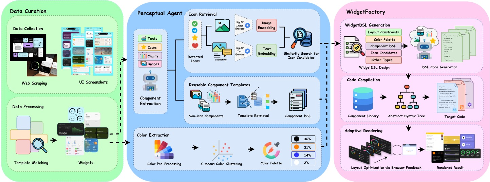
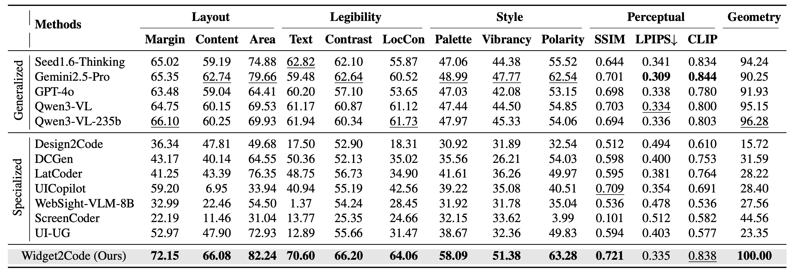

<div align="center">


# 🎨 Widget2Code: From Visual Widgets to UI Code via Multimodal LLMs<br>(CVPR 2026 Highlight)

</div>


<div align="center">
<!--  -->
</div>


Widget2Code is a baseline framework that strengthens both perceptual understanding and system-level generation for transforming visual widgets into UI code. It leverages advanced vision-language models to automatically generate production-ready WidgetDSL from screenshots, featuring icon detection across 57,000+ icons, layout analysis, component recognition and generation. This repository provides the implementation and tools needed to generate high-fidelity widget code.


<div align="center">
  <a href="https://arxiv.org/abs/2512.19918" target="_blank"></a>
  <a href=https://djanghao.github.io/widget2code/ target="_blank"></a>
  <a href=https://github.com/Djanghao/widget2code target="_blank"></a>
  <a href="https://huggingface.co/datasets/Djanghao/widget2code-benchmark" target="_blank"></a>
  <a href="https://www.apache.org/licenses/LICENSE-2.0" target="_blank"></a>
</div>

## 📋 Table of Contents
- [🎨 Widget2Code: From Visual Widgets to UI Code via Multimodal LLMs](#-widget2code-from-visual-widgets-to-ui-code-via-multimodal-llms)
  - [📋 Table of Contents](#-table-of-contents)
  - [🔥🔥🔥 News](#-news)
  - [🎥 Demo](#-demo)
  - [📖 Overview](#-overview)
  - [🏗️ Architecture](#️-architecture)
    - [Generation Pipeline](#generation-pipeline)
  - [🛠️ Dependencies and Installation](#️-dependencies-and-installation)
    - [Quick Install](#quick-install)
  - [⚙️ Configuration](#️-configuration)
  - [🚀 Quick Start](#-quick-start)
    - [Step 1: Start API Service](#step-1-start-api-service)
    - [Step 2: Generate Widgets (Batch)](#step-2-generate-widgets-batch)
    - [Step 3: Render Widgets (Batch)](#step-3-render-widgets-batch)
    - [Step 4: Evaluate Results](#step-4-evaluate-results)
    - [Interactive Playground (Optional)](#interactive-playground-optional)
  - [📊 Benchmarks \& Evaluation](#-benchmarks--evaluation)
    - [Performance Comparison](#performance-comparison)
    - [Evaluation Datasets](#evaluation-datasets)
    - [Download Benchmarks](#download-benchmarks)
  - [📚 Citation](#-citation)


## 🔥🔥🔥 News
* 🌟 Apr 9, 2026: Selected as a CVPR 2026 Highlight
* 📦 Mar 31, 2026: Evaluation toolkit published on [PyPI](https://pypi.org/project/widget2code-bench/)
* 🎉 Feb 21, 2026: Accepted to CVPR 2026
* 📦 Dec 22, 2025: Benchmark dataset uploaded to Hugging Face
* 📄 Dec 22, 2025: Paper uploaded to arXiv
* 🚀 Dec 16, 2025: We release the complete Widget2Code framework including inference code, interactive playground, batch processing scripts, and evaluation tools.


## 🎥 Demo
<div align="center">
  <video src="https://github.com/user-attachments/assets/c3cee1b7-7d03-4988-979b-2ffcec04749b" width="60%" controls></video>
</div>

## 📖 Overview

**Widget2Code** is a baseline framework that strengthens both perceptual understanding and system-level generation for transforming visual widgets into UI code.

## 🏗️ Architecture

Widget2Code employs a sophisticated multi-stage generation pipeline:

### Generation Pipeline

1. **Image Preprocessing**: Resolution normalization, format conversion, and quality analysis
2. **Layout Detection**: Multi-stage layout analysis with intelligent retry mechanism for robust component positioning
3. **Icon Retrieval**: FAISS-based similarity search across 57,000+ icons with dual-encoder (text + image) matching
4. **Chart Recognition**: Specialized detection and classification for 8 chart types using vision models
5. **Color Extraction**: Advanced palette and gradient analysis with perceptual color matching
6. **DSL Generation**: LLM-based structured output generation with domain-specific prompts
7. **Validation**: Schema validation, constraint checking, and error correction
8. **Compilation**: DSL to React JSX/HTML transformation with optimization
9. **Rendering**: Render from code to png in headless browser

<div align="center">
  
</div>

## 🛠️ Dependencies and Installation

### Quick Install

**One-Command Setup**:
```bash
./scripts/setup/install.sh
```

Installs all dependencies including Node.js packages and isolated Python environment.

## ⚙️ Configuration

Create `.env` file with API credentials and ground truth directory:

```bash
cp .env.example .env
# Edit .env and configure:
# - API credentials
# - GT_DIR: Path to ground truth directory for evaluation (e.g., ./data/widget2code-benchmark/test)
```

## 🚀 Quick Start

### Step 1: Start API Service

```bash
# Start API backend (required for batch processing)
npm run api
```

### Step 2: Generate Widgets (Batch)

```bash
# Batch generation with 5 concurrent workers
./scripts/generation/generate-batch.sh ./mockups ./output 5

# Force regenerate all images
./scripts/generation/generate-batch.sh ./mockups ./output 5 --force
```

### Step 3: Render Widgets (Batch)

```bash
# Batch rendering with 5 concurrent workers
./scripts/rendering/render-batch.sh ./output 5

# Force rerender all widgets
./scripts/rendering/render-batch.sh ./output 5 --force
```

### Step 4: Evaluate Results

```bash
# Evaluate generated widgets against ground truth
# If GT_DIR is set in .env, -g flag is optional
./scripts/evaluation/run_evaluation.sh ./output

# Or specify ground truth directory explicitly
./scripts/evaluation/run_evaluation.sh ./output -g ./data/widget2code-benchmark/test

# Use GPU and more workers for faster evaluation
./scripts/evaluation/run_evaluation.sh ./output -g ./data/widget2code-benchmark/test --cuda -w 16
```

### Interactive Playground (Optional)

```bash
# Start interactive playground
npm run playground
```

## 📊 Benchmarks & Evaluation

### Performance Comparison

Widget2Code achieves state-of-the-art performance across multiple quality dimensions including layout accuracy, legibility, style preservation, perceptual similarity, and geometric precision.

<div align="center">
  
</div>

### Evaluation Datasets

Widget2Code has been evaluated on 13 benchmark datasets:
1. Seed1.6-Thinking
2. Gemini2.5-Pro
3. GPT-4o
4. Qwen3-VL
5. Qwen3-VL-235b
6. Design2Code
7. DCGen
8. LatCoder
9. UICopilot
10. WebSight-VLM-8B
11. ScreenCoder
12. UI-UG
13. Widget2Code

### Download Benchmarks

Download the [Widget2Code Benchmark Dataset](https://huggingface.co/datasets/Djanghao/widget2code-benchmark) to the `./data/` folder.

After downloading, set `GT_DIR=./data/widget2code-benchmark/test` in your `.env` file, or use the `-g` flag when running evaluation scripts. The **test split** (`./data/widget2code-benchmark/test`) should be used as ground truth for evaluation.

**Benchmark Results**: [All Methods Results (465MB)](https://drive.google.com/file/d/1LAYReu4fUES1IE0qM7h-zNGvyUgYnqwz/view?usp=sharing) - Download evaluation results across all 13 benchmark datasets and methods from Google Drive.

To use the benchmark results:
```bash
# Install gdown (if not already installed)
pip install gdown

# Download using gdown (465MB)
gdown --fuzzy "https://drive.google.com/file/d/1LAYReu4fUES1IE0qM7h-zNGvyUgYnqwz/view?usp=sharing"

# If download fails, manually download from the link above

# Extract to project root directory
unzip benchmarks_backup_20251216.zip

# Run evaluation on all benchmarks (using test split as ground truth)
./scripts/evaluation/run_all_benchmarks.sh -g ./data/widget2code-benchmark/test --cuda -w 16
```

## 📚 Citation

If you find Widget2Code useful for your research or projects, please cite our work:

```bibtex
@article{widget2code2025,
  title={Widget2Code: From Visual Widgets to UI Code via Multimodal LLMs},
  author={Houston H. Zhang, Tao Zhang, Baoze Lin, Yuanqi Xue, Yincheng Zhu, Huan Liu, Li Gu, Linfeng Ye, Ziqiang Wang, Xinxin Zuo, Yang Wang, Yuanhao Yu, Zhixiang Chi},
  journal={arXiv preprint},
  year={2025}
}
```
