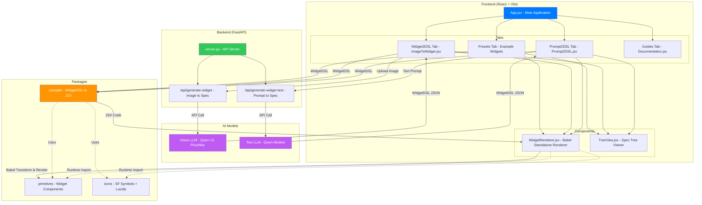
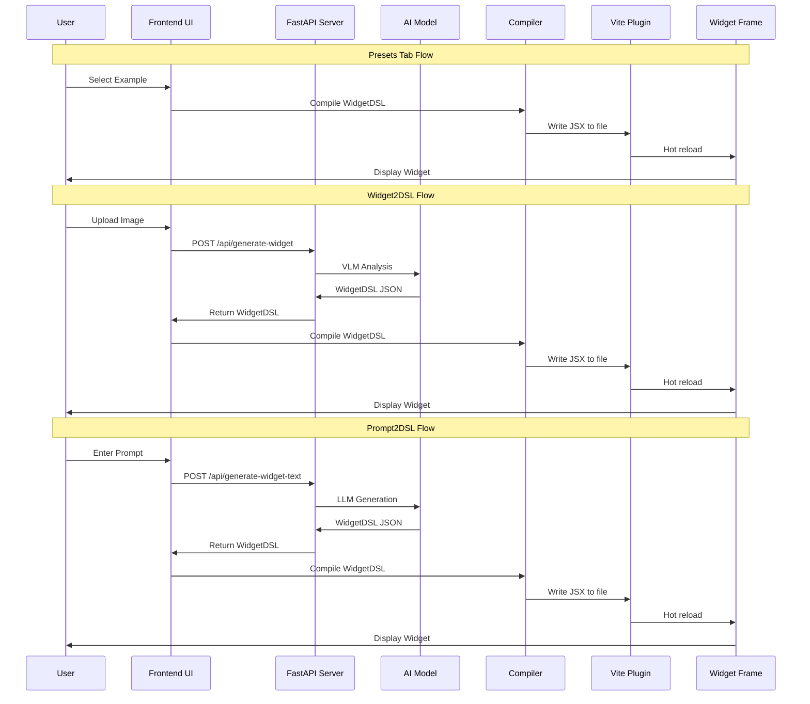
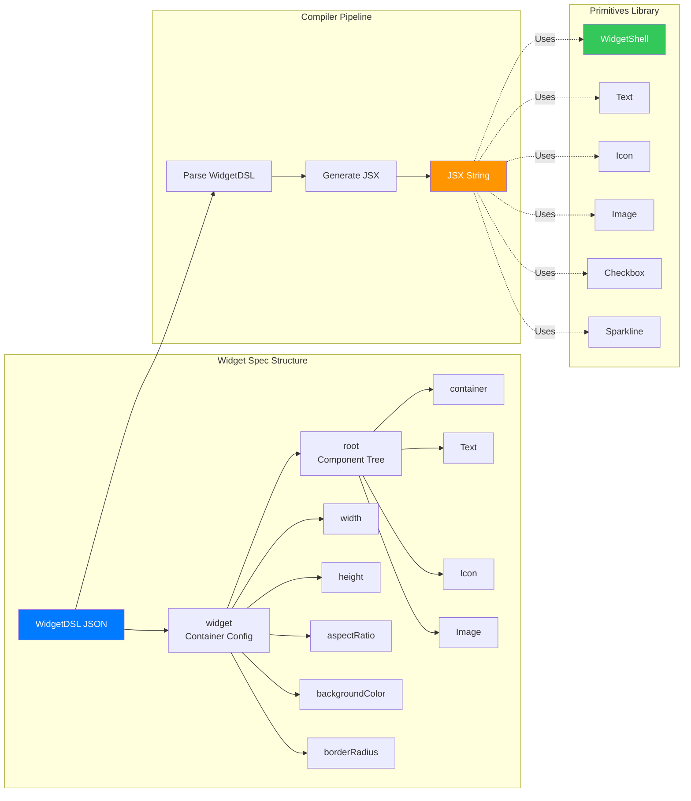
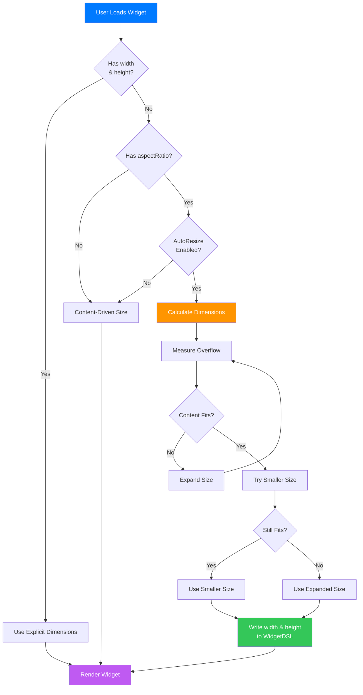

# Playground Architecture

## System Overview



## Data Flow



## Component Architecture



## File Structure

```
apps/playground/
├── src/
│   ├── App.jsx                    # Main application with tabs
│   ├── main.jsx                   # Entry point
│   ├── ImageToWidget.jsx          # Widget2DSL tab
│   ├── Prompt2DSL.jsx            # Prompt2DSL tab
│   ├── Documentation.jsx          # Guides tab
│   ├── TreeView.jsx               # Spec tree viewer
│   ├── components/
│   │   ├── core/                  # Core UI components
│   │   └── Documentation/         # Documentation components
│   ├── examples/
│   │   └── *.json                 # Preset widget specs
│   └── hooks/
│       └── useAutoResize.js       # Auto-resize logic
├── vite.config.js                 # Vite configuration
└── package.json                   # Dependencies

apps/api/
├── server.py                      # FastAPI server
├── *.md                           # System prompts
└── .venv/                         # Python dependencies

packages/
├── compiler/                      # WidgetDSL to JSX compiler
├── primitives/                    # Widget UI components
├── icons/                         # SF Symbols + Lucide icons
├── spec/                          # WidgetDSL protocol & validation
├── renderer/                      # Runtime JSX renderer
└── exporter/                      # Widget export utilities
```

## Key Technologies

### Frontend
- **React 18** - UI framework
- **Vite** - Build tool with HMR
- **react-dropzone** - File upload
- **react-syntax-highlighter** - Code display

### Backend
- **FastAPI** - Python web framework
- **Qwen VL** - Vision language model
- **Qwen** - Text language model
- **PIL** - Image processing

### Widget System
- **@widget-factory/compiler** - WidgetDSL to JSX compiler
- **@widget-factory/primitives** - Widget components
- **@widget-factory/icons** - SF Symbols + Lucide icons

## AutoResize System



## Tab Functionality

### Presets Tab
- Browse and select pre-built widget examples
- Edit WidgetDSL JSON in real-time
- View generated JSX code
- Visualize component tree
- Resize widget with aspect ratio lock
- Auto-resize to fit content

### Widget2DSL Tab
- Upload widget screenshots
- Select icon library (SF Symbols, Lucide, or both)
- Choose Qwen vision model
- Customize system prompt
- Generate WidgetDSL from image
- Preview and iterate

### Prompt2DSL Tab
- Describe widget in natural language
- Select icon library preference
- Choose Qwen model (text or vision)
- Customize system prompt
- Generate WidgetDSL from description
- Preview and refine

### Guides Tab
- WidgetShell sizing rules
- Icon system documentation
- Component type reference
- Live component examples
- Interactive navigation
